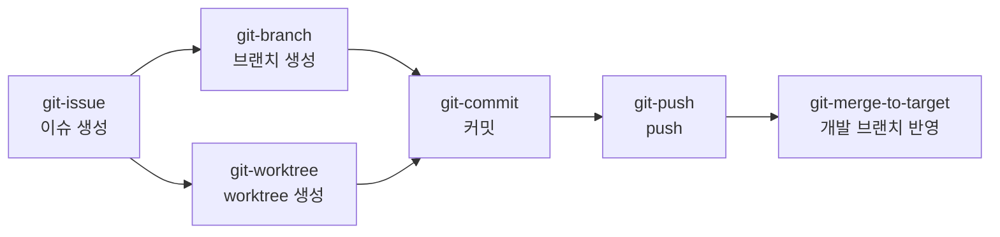

# AI Agent Toolkit

AI 코딩 에이전트가 활용할 수 있는 Skill, MCP 등의 toolkit을 정리해 둔 저장소입니다.
에이전트가 반복되는 개발 작업을 항상 같은 규칙과 절차로 수행하도록, 작업 규칙 문서와 실행 스크립트를 함께 관리합니다.

## 목차

- [Toolkit 목록](#toolkit-목록)
  - [Skills](#skills)
  - [MCP](#mcp)
- [Git 워크플로 스킬](#git-워크플로-스킬)
- [사용 방법](#사용-방법)
- [요구 사항](#요구-사항)
- [Toolkit 추가 가이드](#toolkit-추가-가이드)

## Toolkit 목록

### Skills

| 스킬 | 설명 | 실행 스크립트 | 추가로 필요한 도구 |
|---|---|---|---|
| [git-branch](.agents/skills/git-branch/SKILL.md) | 작업 내용에 맞는 prefix와 영문 브랜치명을 정하고, develop/dev 개발 브랜치에서 새 브랜치 생성 | `create-branch.sh` | - |
| [git-worktree](.agents/skills/git-worktree/SKILL.md) | git-branch 규칙으로 새 브랜치를 만들고, `.agents/worktree/` 아래에 브랜치별 독립 작업 디렉터리 생성 | `create-worktree.sh` | git-branch 스킬 |
| [git-commit](.agents/skills/git-commit/SKILL.md) | 스테이징한 변경 사항을 `type: 제목` 형식의 메시지로 커밋 | `commit.sh` | - |
| [git-push](.agents/skills/git-push/SKILL.md) | 현재 브랜치를 같은 이름의 원격 브랜치로 push하고 push 후 상태 확인 | `push.sh` | - |
| [git-merge-to-target](.agents/skills/git-merge-to-target/SKILL.md) | source 브랜치를 target 브랜치에 merge하고 target 브랜치를 원격에 push | `merge-to-target.sh` | - |
| [git-issue](.agents/skills/git-issue/SKILL.md) | 사용자 설명을 요구사항 중심으로 정리해 GitHub 이슈 생성 | `create-issue.sh` | GitHub CLI(`gh`) |

### MCP

MCP 서버를 추가하면 이 목록에 서버 이름, 용도, 설정 방법을 정리합니다.

## Git 워크플로 스킬

Git 스킬은 이슈 등록부터 개발 브랜치 반영까지 이어서 사용할 수 있도록 규칙을 맞춰 두었습니다.



- git-issue로 만든 이슈 번호를 git-branch나 git-worktree에 `--issue`로 넘기면 `feat/128-...` 형식의 브랜치가 만들어집니다.
- 이슈 번호가 들어간 브랜치에서 git-commit으로 커밋하면 `Refs: #128` 푸터가 자동으로 붙습니다.

### type 공통 규칙

브랜치 prefix, 커밋 메시지 type, 이슈 제목 type은 모두 같은 6가지를 사용합니다.

| type | 용도 |
|---|---|
| `feat` | 새 기능 추가 |
| `fix` | 버그 수정 |
| `refactor` | 리팩토링 및 코드 정리 |
| `chore` | 환경 설정, 빌드 작업 |
| `docs` | 문서 및 주석 작성 |
| `test` | 테스트 코드 |

| 대상 | 형식 | 예시 |
|---|---|---|
| 브랜치 (git-branch, git-worktree) | `<type>/<영문 작업명>` | `feat/128-add-kakao-social-login` |
| 커밋 메시지 (git-commit) | `<type>: <제목>` | `feat: 카카오 소셜 로그인 API 추가` |
| 이슈 제목 (git-issue) | `<type>: <제목>` | `feat: 카카오 소셜 로그인 기능 구현` |

### 스크립트 공통 설계

- 에이전트가 git 명령을 직접 조합하지 않고 스킬의 스크립트를 실행하도록 해서, 누가 실행하더라도 같은 결과를 얻도록 합니다.
- 실행 결과는 표준 출력에 `key=value` 형식으로 출력하고, 진행 로그와 경고는 표준 에러에 출력합니다.
- 실패 원인은 종료 코드로 구분하며, 종료 코드별로 에이전트가 해야 할 대응은 각 SKILL.md에 정리되어 있습니다.
- `--dry-run` 옵션으로 실제 변경 없이 검증 결과를 먼저 확인할 수 있습니다.
- 보호 브랜치 작업처럼 사용자 판단이 필요한 동작은 `--allow-*` 옵션을 붙여야만 진행하며, 에이전트는 사용자 승인을 받은 뒤에만 이 옵션을 사용합니다.
- 강제 push(`--force`)나 훅 우회(`--no-verify`)처럼 되돌리기 어렵거나 검증을 건너뛰는 옵션은 사용하지 않습니다.

### 스킬별 요약

스크립트는 작업할 Git 저장소 안에서 실행합니다. 아래 예시의 스크립트 경로는 이 저장소를 기준으로 작성했습니다.

#### git-branch

- develop, dev, development 중 실제로 있는 개발 브랜치를 찾고, 원격 저장소의 최신 상태에서 새 브랜치를 만듭니다.
- 브랜치명은 영문 소문자, 숫자, `-`만 사용하며, prefix를 포함해 50자 이내로 작성합니다.

```bash
bash .agents/skills/git-branch/scripts/create-branch.sh feat "add kakao social login" --issue 128
```

#### git-worktree

- git-branch 스크립트로 브랜치명과 기준 브랜치를 검증한 뒤, 저장소 루트의 `.agents/worktree/`에 브랜치별 worktree를 만듭니다. 디렉터리 이름은 브랜치명의 `/`를 `-`로 바꾼 이름입니다.
- 현재 작업 디렉터리는 변경하지 않으며, worktree 경로는 `.git/info/exclude`에 등록해 Git 추적 대상에서 제외합니다.

```bash
bash .agents/skills/git-worktree/scripts/create-worktree.sh feat "add kakao social login" --issue 128
```

#### git-commit

- 스테이징한 변경 사항만 커밋하며, 제목 줄은 type을 포함해 72자 이내로 작성합니다.
- 보호 브랜치(main, develop 등)에 직접 커밋하거나 `.env` 같은 민감한 파일을 커밋하려고 하면 멈춥니다.

```bash
bash .agents/skills/git-commit/scripts/commit.sh feat "카카오 소셜 로그인 API 추가" --body "- 토큰 검증 로직 추가"
```

#### git-push

- 현재 브랜치를 같은 이름의 원격 브랜치로 push하고 upstream을 설정합니다.
- 원격 브랜치와 이력이 어긋나 있으면 강제 push하지 않고 멈추며, push 후에는 원격 브랜치가 로컬 HEAD와 같은 커밋을 가리키는지 확인합니다.

```bash
bash .agents/skills/git-push/scripts/push.sh
```

#### git-merge-to-target

- target 브랜치를 원격 최신 상태로 맞춘 뒤 `--no-ff` 방식으로 merge 커밋을 만들고 push합니다. source 브랜치를 생략하면 현재 브랜치를 사용합니다.
- 충돌이 예상되면 작업 트리를 변경하기 전에 멈추고, push에 실패하면 로컬 target 브랜치를 merge 이전 상태로 되돌립니다.

```bash
bash .agents/skills/git-merge-to-target/scripts/merge-to-target.sh develop --dry-run
```

#### git-issue

- 사용자의 설명을 개요, 요구사항, 완료 조건 섹션으로 정리해 GitHub 이슈를 만듭니다. 버그 이슈에는 재현 방법, 기대 동작, 실제 동작 섹션을 추가할 수 있습니다.
- 이슈는 저장소 구성원에게 공개되므로, `--dry-run` 미리보기를 사용자에게 보여 주고 승인을 받은 뒤 생성합니다.

```bash
bash .agents/skills/git-issue/scripts/create-issue.sh feat "카카오 소셜 로그인 기능 구현" \
  --summary "카카오 계정으로 로그인할 수 있도록 소셜 로그인 기능을 추가한다." \
  --requirement "카카오 OAuth 인증으로 로그인할 수 있다" \
  --criteria "카카오 계정으로 로그인하면 JWT가 발급된다" \
  --dry-run
```

## 사용 방법

### Claude Code에서 사용하기

- 이 저장소를 Claude Code로 열면 `.claude/skills/` 아래의 스킬이 자동으로 인식됩니다. `.claude`는 원본 디렉터리인 `.agents`를 가리키는 심볼릭 링크이므로, `.agents/skills/` 아래의 파일을 수정하면 Claude Code에도 그대로 반영됩니다.
- `/git-branch`처럼 스킬 이름으로 직접 호출할 수 있습니다. "develop 기준으로 로그인 기능 브랜치 만들어줘"처럼 요청해도, 에이전트가 스킬 설명을 보고 알맞은 스킬을 사용합니다.
- 세션을 시작한 뒤에 `.claude/skills` 디렉터리를 새로 만들었다면, Claude Code를 재시작해야 스킬이 인식됩니다.

### 다른 프로젝트에서 사용하기

모든 프로젝트에서 사용하려면 개인 스킬 디렉터리(`~/.claude/skills/`)에 스킬 디렉터리를 심볼릭 링크로 연결합니다. 이 저장소의 스킬을 수정하면 연결한 모든 곳에 바로 반영됩니다.

```bash
mkdir -p ~/.claude/skills
for skill in /path/to/ai-agent-toolkit/.agents/skills/*/; do
  ln -s "${skill%/}" ~/.claude/skills/
done
```

특정 프로젝트에만 적용하려면 스킬 디렉터리를 해당 프로젝트의 `.claude/skills/`에 복사합니다.

```bash
mkdir -p <프로젝트 경로>/.claude/skills
cp -R /path/to/ai-agent-toolkit/.agents/skills/git-* <프로젝트 경로>/.claude/skills/
```

- git-worktree 스킬은 git-branch 스킬의 스크립트를 사용하므로, 두 스킬을 함께 등록해야 합니다.

### 다른 AI 코딩 에이전트에서 사용하기

- 각 스킬은 YAML frontmatter(`name`, `description`)와 마크다운 본문으로 구성된 SKILL.md 형식을 따릅니다. 이 형식을 지원하는 에이전트라면, 그 에이전트가 스킬을 읽는 경로에 `.agents/skills/<스킬 이름>` 디렉터리를 연결해서 사용할 수 있습니다.
- SKILL.md에 적힌 `${CLAUDE_SKILL_DIR}`는 Claude Code 전용 변수입니다. 다른 에이전트에서는 해당 스킬 디렉터리의 경로를 직접 사용합니다.

## 요구 사항

| 항목 | 버전 | 사용하는 스킬 |
|---|---|---|
| bash (macOS 또는 Linux) | 3.2 이상 | 모든 스킬 |
| Git | 2.23 이상 (merge 충돌 사전 검사는 2.38 이상) | 모든 스킬 |
| GitHub CLI(`gh`) | 2.20 이상, `gh auth login`으로 인증 필요 | git-issue |

- Windows에서 이 저장소를 clone하면 `.claude` 심볼릭 링크가 링크 경로만 담긴 일반 파일로 체크아웃될 수 있습니다. Git의 `core.symlinks=true` 설정과 심볼릭 링크를 만들 수 있는 권한이 필요합니다.

## Toolkit 추가 가이드

### 스킬 추가

1. `.agents/skills/<스킬 이름>/SKILL.md`를 만듭니다. 스킬 이름은 영문 소문자, 숫자, `-`로 작성하고, frontmatter의 `name`과 디렉터리 이름을 같게 합니다.
2. frontmatter의 `description`에는 스킬이 하는 일과 스킬을 사용해야 하는 요청 상황을 함께 적습니다. 에이전트는 이 설명을 보고 스킬 사용 여부를 판단합니다.
3. 매번 같은 결과가 나와야 하는 작업은 `scripts/`에 셸 스크립트로 작성하고, SKILL.md에 실행 방법과 종료 코드별 대응을 정리합니다.
4. 스킬 디렉터리는 `skills/` 바로 아래에 둡니다. `skills/git/git-branch`처럼 묶음 폴더를 두면 Claude Code가 스킬로 인식하지 못합니다.
5. 스크립트는 macOS 기본 bash 3.2에서도 동작하도록 작성하고, [shellcheck](https://www.shellcheck.net/)로 검사합니다.
6. 스킬을 추가하면 이 README의 [Toolkit 목록](#toolkit-목록)에도 추가합니다.

### MCP 추가

- MCP 서버를 추가하면 [MCP](#mcp) 목록에 서버 이름, 용도, 설정 파일 위치, 필요한 인증 방식을 정리합니다.
- API 키나 토큰 같은 인증 정보는 저장소에 커밋하지 않습니다.
