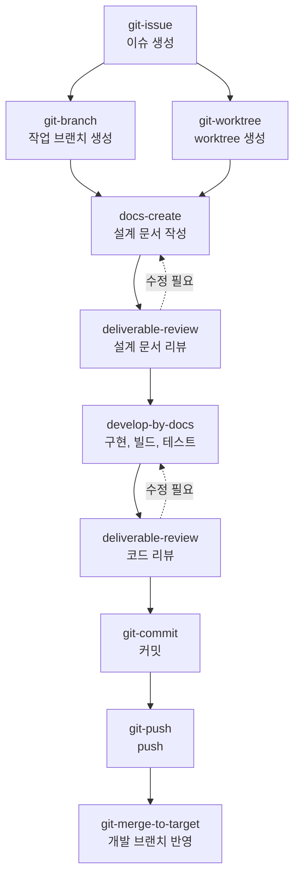

# AI Agent Toolkit

AI 코딩 에이전트가 활용할 수 있는 Skill, MCP 등의 toolkit을 정리해 둔 저장소입니다.
에이전트가 반복되는 개발 작업을 항상 같은 규칙과 절차로 수행하도록, 작업 규칙 문서와 실행 스크립트를 함께 관리합니다.
이슈 등록부터 설계 문서 작성, 구현, 리뷰, 커밋과 병합까지 개발 과정 전체를 스킬로 이어서 진행할 수 있습니다.

## 목차

- [Toolkit 목록](#toolkit-목록)
  - [Skills](#skills)
  - [MCP](#mcp)
- [개발 흐름](#개발-흐름)
- [Git 워크플로 스킬](#git-워크플로-스킬)
- [문서 기반 개발 스킬](#문서-기반-개발-스킬)
- [스킬 공통 설계](#스킬-공통-설계)
- [사용 방법](#사용-방법)
- [요구 사항](#요구-사항)
- [Toolkit 추가 가이드](#toolkit-추가-가이드)

## Toolkit 목록

### Skills

**Git 워크플로**

| 스킬 | 설명 | 실행 스크립트 | 추가로 필요한 도구 |
|---|---|---|---|
| [git-issue](.agents/skills/git-issue/SKILL.md) | 사용자 설명을 요구사항 중심으로 정리해 GitHub 이슈 생성 | `create-issue.sh` | GitHub CLI(`gh`) |
| [git-branch](.agents/skills/git-branch/SKILL.md) | 작업 내용에 맞는 prefix와 영문 브랜치명을 정하고, develop/dev 개발 브랜치에서 새 브랜치 생성 | `create-branch.sh` | - |
| [git-worktree](.agents/skills/git-worktree/SKILL.md) | git-branch 규칙으로 새 브랜치를 만들고, `.agents/worktree/` 아래에 브랜치별 독립 작업 디렉터리 생성 | `create-worktree.sh` | git-branch 스킬 |
| [git-commit](.agents/skills/git-commit/SKILL.md) | 스테이징한 변경 사항을 `type: 제목` 형식의 메시지로 커밋 | `commit.sh` | - |
| [git-push](.agents/skills/git-push/SKILL.md) | 현재 브랜치를 같은 이름의 원격 브랜치로 push하고 push 후 상태 확인 | `push.sh` | - |
| [git-merge-to-target](.agents/skills/git-merge-to-target/SKILL.md) | source 브랜치를 target 브랜치에 merge하고 target 브랜치를 원격에 push | `merge-to-target.sh` | - |

**문서 기반 개발**

| 스킬 | 설명 | 실행 스크립트 | 추가로 필요한 도구 |
|---|---|---|---|
| [docs-create](.agents/skills/docs-create/SKILL.md) | 사용자 요구사항을 바탕으로 프로젝트 루트의 `docs/YYMMDD/` 아래에 구현 설계 문서 작성 | `create-doc.sh`, `check-doc.sh` | - |
| [develop-by-docs](.agents/skills/develop-by-docs/SKILL.md) | docs-create로 작성한 설계 문서를 기반으로 작업 브랜치에서 코드를 구현하고 빌드와 테스트 수행 | `preflight.sh`, `build.sh` | docs-create 스킬, 프로젝트 빌드 도구 |
| [deliverable-review](.agents/skills/deliverable-review/SKILL.md) | 설계 문서나 코드 변경 사항을 정해진 관점과 심각도 기준으로 리뷰하고 리뷰 보고서 작성 | `review-context.sh`, `create-report.sh`, `check-report.sh` | docs-create 스킬 |

### MCP

MCP 서버를 추가하면 이 목록에 서버 이름, 용도, 설정 방법을 정리합니다.

## 개발 흐름

각 스킬은 따로 사용할 수도 있고, 아래 순서대로 이어서 사용하면 이슈 등록부터 개발 브랜치 반영까지 한 흐름으로 진행할 수 있습니다.



| 단계 | 스킬 | 결과물 |
|---|---|---|
| 1. 이슈 등록 | git-issue | GitHub 이슈 (`feat: 카카오 소셜 로그인 기능 구현`) |
| 2. 작업 공간 준비 | git-branch 또는 git-worktree | 작업 브랜치 `feat/128-add-kakao-social-login` (worktree는 `.agents/worktree/` 아래에 생성) |
| 3. 설계 | docs-create | 설계 문서 `docs/<YYMMDD>/<영문 문서명>.md` |
| 4. 설계 리뷰 | deliverable-review | 리뷰 보고서 `docs/<YYMMDD>/<영문 문서명>-doc-review.md` |
| 5. 구현 | develop-by-docs | 코드와 테스트, 빌드 결과 |
| 6. 코드 리뷰 | deliverable-review | 리뷰 보고서 `docs/<YYMMDD>/<영문 문서명>-code-review.md` |
| 7. 커밋과 push | git-commit, git-push | `Refs: #128` 푸터가 붙은 커밋과 원격 작업 브랜치 |
| 8. 반영 | git-merge-to-target | 개발 브랜치의 merge 커밋 |

스킬끼리는 이슈 번호와 설계 문서로 연결됩니다.

- git-issue로 만든 이슈 번호를 git-branch나 git-worktree에 `--issue`로 넘기면 `feat/128-...` 형식의 브랜치가 만들어집니다.
- 이슈 번호가 들어간 브랜치에서 git-commit으로 커밋하면 `Refs: #128` 푸터가 자동으로 붙습니다.
- docs-create에 `--issue`로 이슈 번호를 넘기면 설계 문서의 관련 이슈에 기록됩니다. develop-by-docs는 브랜치의 이슈 번호와 설계 문서의 관련 이슈가 다르면 경고하고, deliverable-review는 같은 이슈 번호의 설계 문서를 찾아 코드 리뷰에 함께 사용합니다.
- 리뷰 보고서는 리뷰한 날짜의 디렉터리에 만들어집니다. 설계 문서를 작성한 날 리뷰까지 마치면 다음과 같이 한 디렉터리에 모입니다.

```
docs/
└── 260915/
    ├── kakao-social-login.md               # 설계 문서 (docs-create)
    ├── kakao-social-login-doc-review.md    # 설계 문서 리뷰 보고서 (deliverable-review)
    └── kakao-social-login-code-review.md   # 코드 리뷰 보고서 (deliverable-review)
```

## Git 워크플로 스킬

Git 스킬은 이슈, 브랜치, 커밋의 이름 규칙을 맞춰 두어서 서로 이어서 사용할 수 있습니다.

### type 공통 규칙

브랜치 prefix, 커밋 메시지 type, 이슈 제목 type은 모두 같은 6가지를 사용합니다.

| type | 용도 |
|---|---|
| `feat` | 새 기능 추가 |
| `fix` | 버그 수정 |
| `refactor` | 리팩토링 및 코드 정리 |
| `chore` | 환경 설정, 빌드 작업 |
| `docs` | 문서 및 주석 작성 |
| `test` | 테스트 코드 |

| 대상 | 형식 | 예시 |
|---|---|---|
| 이슈 제목 (git-issue) | `<type>: <제목>` | `feat: 카카오 소셜 로그인 기능 구현` |
| 브랜치 (git-branch, git-worktree) | `<type>/<영문 작업명>` | `feat/128-add-kakao-social-login` |
| 커밋 메시지 (git-commit) | `<type>: <제목>` | `feat: 카카오 소셜 로그인 API 추가` |

### Git 스킬별 요약

아래 예시의 스크립트 경로는 이 저장소를 기준으로 작성했습니다.

#### git-issue

- 사용자의 설명을 개요, 요구사항, 완료 조건 섹션으로 정리해 GitHub 이슈를 만듭니다. 버그 이슈에는 재현 방법, 기대 동작, 실제 동작 섹션을 추가할 수 있습니다.
- 이슈는 저장소 구성원에게 공개되므로, `--dry-run` 미리보기를 사용자에게 보여 주고 승인을 받은 뒤 생성합니다.

```bash
bash .agents/skills/git-issue/scripts/create-issue.sh feat "카카오 소셜 로그인 기능 구현" \
  --summary "카카오 계정으로 로그인할 수 있도록 소셜 로그인 기능을 추가한다." \
  --requirement "카카오 OAuth 인증으로 로그인할 수 있다" \
  --criteria "카카오 계정으로 로그인하면 JWT가 발급된다" \
  --dry-run
```

#### git-branch

- develop, dev, development 중 실제로 있는 개발 브랜치를 찾고, 원격 저장소의 최신 상태에서 새 브랜치를 만듭니다.
- 브랜치명은 영문 소문자, 숫자, `-`만 사용하며, prefix를 포함해 50자 이내로 작성합니다.

```bash
bash .agents/skills/git-branch/scripts/create-branch.sh feat "add kakao social login" --issue 128
```

#### git-worktree

- git-branch 스크립트로 브랜치명과 기준 브랜치를 검증한 뒤, 저장소 루트의 `.agents/worktree/`에 브랜치별 worktree를 만듭니다. 디렉터리 이름은 브랜치명의 `/`를 `-`로 바꾼 이름입니다.
- 현재 작업 디렉터리는 변경하지 않으며, worktree 경로는 `.git/info/exclude`에 등록해 Git 추적 대상에서 제외합니다.

```bash
bash .agents/skills/git-worktree/scripts/create-worktree.sh feat "add kakao social login" --issue 128
```

#### git-commit

- 스테이징한 변경 사항만 커밋하며, 제목 줄은 type을 포함해 72자 이내로 작성합니다.
- 보호 브랜치(main, develop 등)에 직접 커밋하거나 `.env` 같은 민감한 파일을 커밋하려고 하면 멈춥니다.

```bash
bash .agents/skills/git-commit/scripts/commit.sh feat "카카오 소셜 로그인 API 추가" --body "- 토큰 검증 로직 추가"
```

#### git-push

- 현재 브랜치를 같은 이름의 원격 브랜치로 push하고 upstream을 설정합니다.
- 원격 브랜치와 이력이 어긋나 있으면 강제 push하지 않고 멈추며, push 후에는 원격 브랜치가 로컬 HEAD와 같은 커밋을 가리키는지 확인합니다.

```bash
bash .agents/skills/git-push/scripts/push.sh
```

#### git-merge-to-target

- target 브랜치를 원격 최신 상태로 맞춘 뒤 `--no-ff` 방식으로 merge 커밋을 만들고 push합니다. source 브랜치를 생략하면 현재 브랜치를 사용합니다.
- 충돌이 예상되면 작업 트리를 변경하기 전에 멈추고, push에 실패하면 로컬 target 브랜치를 merge 이전 상태로 되돌립니다.

```bash
bash .agents/skills/git-merge-to-target/scripts/merge-to-target.sh develop --dry-run
```

## 문서 기반 개발 스킬

요구사항을 설계 문서로 정리하고, 설계 문서를 기준으로 구현한 뒤, 설계와 구현 결과를 리뷰하는 스킬입니다. 세 스킬은 같은 설계 문서 형식을 사용합니다.

### 설계 문서 형식

- 설계 문서는 프로젝트 루트의 `docs/<YYMMDD>/<영문 문서명>.md`에 작성합니다. `<YYMMDD>`는 문서를 처음 작성한 날짜이며, 나중에 문서를 수정해도 디렉터리를 옮기지 않습니다.
- 영문 문서명은 영문 소문자, 숫자, `-`만 사용해 50자 이내로 작성합니다.
- 문서는 아래 목차로 작성하며, 해당하는 내용이 없는 섹션도 지우지 않고 "해당 없음"과 이유를 적습니다.

| 섹션 | 작성 내용 |
|---|---|
| 메타데이터 표 | 작성일, 작성자, 상태(초안, 검토 중, 확정), 관련 이슈 |
| 1. 개요 | 배경, 목표, 범위 |
| 2. 요구사항 | 기능 요구사항(FR-1부터 번호), 비기능 요구사항(NFR-1부터 번호) |
| 3. 설계 | 전체 구조, 주요 흐름, 데이터 모델, API 및 인터페이스, 예외 처리 |
| 4. 구현 계획 | 작업 목록, 변경 대상 |
| 5. 테스트 계획 | 요구사항 ID별 테스트 시나리오 |
| 6. 고려 사항 | 대안 검토, 위험 요소, 미결정 사항 |
| 변경 이력 | 날짜, 변경 내용, 작성자 |

- 요구사항 ID는 작업 목록과 테스트 계획에서 다시 참조합니다. deliverable-review는 이 ID를 기준으로 요구사항이 빠짐없이 반영되었는지 확인합니다.
- 목차는 docs-create 스킬의 `templates/design-doc.md`에서 관리합니다. 템플릿을 수정하면 문서 생성과 검증 기준이 함께 바뀝니다.

### 리뷰 기준

deliverable-review는 지적 사항마다 심각도를 정하고, 심각도에 따라 결론을 정합니다.

| 심각도 | 기준 |
|---|---|
| 높음 | 버그, 보안 취약점, 데이터 손실 가능성, 요구사항 미반영, 빌드나 테스트 실패처럼 반드시 고쳐야 하는 문제 |
| 중간 | 테스트 누락, 예외 처리 부족, 설계와의 불일치처럼 merge 전에 고치는 것이 좋은 문제 |
| 낮음 | 이름, 가독성, 사소한 개선처럼 선택적으로 반영해도 되는 의견 |

| 결론 | 기준 |
|---|---|
| 승인 | 높음과 중간 지적 사항이 없습니다. |
| 조건부 승인 | 높음 지적 사항은 없고, 중간 지적 사항을 고치는 조건으로 승인합니다. |
| 수정 필요 | 높음 지적 사항이 하나 이상 있습니다. |

### 문서 기반 개발 스킬별 요약

아래 예시의 스크립트 경로는 이 저장소를 기준으로 작성했습니다.

#### docs-create

- 요구사항에서 목적, 기능, 제약 조건, 범위를 추출해 설계 문서를 작성합니다. 설계 방향을 바꾸는 불명확한 내용만 먼저 질문하고, 작성 중에 가정한 내용은 미결정 사항에 적습니다.
- 작성 전에 관련 코드와 기존 설계 문서를 조사하고, 존재하지 않는 클래스나 테이블을 있는 것처럼 쓰지 않습니다.
- `create-doc.sh`가 템플릿으로 문서를 만들고, 내용을 채운 뒤 `check-doc.sh`로 필수 섹션, 빈 섹션, 남은 안내 주석을 검증합니다.

```bash
bash .agents/skills/docs-create/scripts/create-doc.sh "kakao social login" --title "카카오 소셜 로그인 구현 설계" --issue 128
bash .agents/skills/docs-create/scripts/check-doc.sh docs/260915/kakao-social-login.md
```

#### develop-by-docs

- main, master, develop, dev, development 같은 보호 브랜치에서는 구현하지 않으며, 별도 작업 브랜치인지 먼저 확인합니다.
- 설계 문서의 작업 목록 순서와 변경 대상 범위 안에서 구현하고, 테스트 계획에 따라 테스트 코드를 작성합니다. 설계대로 구현할 수 없으면 멈추고 사용자에게 확인합니다.
- `build.sh`가 Gradle, Maven, npm 계열, Go, Cargo 프로젝트를 감지해 빌드와 테스트를 실행합니다. 테스트를 삭제하거나 건너뛰어서 빌드를 통과시키지 않습니다.

```bash
bash .agents/skills/develop-by-docs/scripts/preflight.sh docs/260915/kakao-social-login.md
bash .agents/skills/develop-by-docs/scripts/build.sh
```

#### deliverable-review

- 설계 문서는 구조 검사와 요구사항 추적 결과를, 코드 변경은 기준 브랜치와 비교한 전체 변경(커밋하지 않은 변경 포함)과 자동 검사 결과를 근거로 리뷰합니다.
- 자동 검사는 충돌 표시, 민감 정보로 의심되는 값, 민감한 파일, 테스트 누락, 디버그 출력, TODO를 찾으며, 민감 정보는 값을 기록하지 않고 위치만 남깁니다.
- 리뷰 중에는 산출물을 수정하지 않습니다. 근거 위치를 확인한 지적 사항만 보고서에 적고, `check-report.sh`로 결론이 리뷰 기준에 맞는지 검증합니다.
- 같은 날 같은 대상을 다시 리뷰하면 기존 보고서를 덮어쓰지 않고 `-review-2.md`처럼 차수를 붙인 보고서를 만듭니다.

```bash
bash .agents/skills/deliverable-review/scripts/review-context.sh code --base develop
bash .agents/skills/deliverable-review/scripts/create-report.sh code kakao-social-login \
  --title "카카오 소셜 로그인 구현" \
  --target "feat/128-add-kakao-social-login (기준: origin/develop)"
bash .agents/skills/deliverable-review/scripts/check-report.sh docs/260915/kakao-social-login-code-review.md
```

## 스킬 공통 설계

- 에이전트가 명령을 직접 조합하지 않고 스킬의 스크립트를 실행하도록 해서, 누가 실행하더라도 같은 결과를 얻도록 합니다.
- 스크립트는 작업할 Git 저장소 안에서 실행합니다.
- 실행 결과는 표준 출력에 `key=value` 형식으로 출력하고, 진행 로그와 경고는 표준 에러에 출력합니다.
- 실패 원인은 종료 코드로 구분하며, 종료 코드별로 에이전트가 해야 할 대응은 각 SKILL.md에 정리되어 있습니다.
- `--dry-run` 옵션으로 실제 변경 없이 검증 결과를 먼저 확인할 수 있습니다.
- 보호 브랜치 작업처럼 사용자 판단이 필요한 동작은 `--allow-*` 옵션을 붙여야만 진행하며, 에이전트는 사용자 승인을 받은 뒤에만 이 옵션을 사용합니다.
- 파일을 만드는 스크립트는 기존 파일을 덮어쓰지 않습니다.
- 정해진 형식의 문서를 만드는 스킬은 `templates/`의 템플릿을 생성 스크립트와 검증 스크립트가 함께 읽어서, 문서 형식과 검증 기준이 어긋나지 않게 합니다.
- 다른 스킬의 규칙이 필요하면 규칙을 복사하지 않고 그 스킬의 스크립트를 호출합니다. (git-worktree는 git-branch, develop-by-docs와 deliverable-review는 docs-create의 스크립트를 사용합니다.)
- 강제 push(`--force`), 훅 우회(`--no-verify`), 테스트 건너뛰기처럼 되돌리기 어렵거나 검증을 건너뛰는 동작은 사용하지 않습니다.

## 사용 방법

### Claude Code에서 사용하기

- 이 저장소를 Claude Code로 열면 `.claude/skills/` 아래의 스킬이 자동으로 인식됩니다. `.claude`는 원본 디렉터리인 `.agents`를 가리키는 심볼릭 링크이므로, `.agents/skills/` 아래의 파일을 수정하면 Claude Code에도 그대로 반영됩니다.
- `/git-branch`처럼 스킬 이름으로 직접 호출할 수 있습니다. 아래처럼 자연어로 요청해도, 에이전트가 스킬 설명을 보고 알맞은 스킬을 사용합니다.
- 세션을 시작한 뒤에 `.claude/skills` 디렉터리를 새로 만들었다면, Claude Code를 재시작해야 스킬이 인식됩니다.

| 요청 예시 | 사용하는 스킬 |
|---|---|
| "로그인 실패 시 에러 메시지가 안 나오는 버그를 이슈로 등록해줘" | git-issue |
| "128번 이슈로 develop 기준 작업 브랜치 만들어줘" | git-branch |
| "지금 작업은 그대로 두고 새 worktree에서 결제 기능을 작업하게 해줘" | git-worktree |
| "이 요구사항으로 구현 설계 문서 작성해줘" | docs-create |
| "docs/260915/kakao-social-login.md 설계 문서대로 구현해줘" | develop-by-docs |
| "방금 작성한 설계 문서 리뷰해줘", "구현한 코드 리뷰해줘" | deliverable-review |
| "변경 사항 커밋해줘" | git-commit |
| "원격에 푸시해줘" | git-push |
| "develop에 머지하고 푸시해줘" | git-merge-to-target |

### 다른 프로젝트에서 사용하기

모든 프로젝트에서 사용하려면 개인 스킬 디렉터리(`~/.claude/skills/`)에 스킬 디렉터리를 심볼릭 링크로 연결합니다. 이 저장소의 스킬을 수정하면 연결한 모든 곳에 바로 반영됩니다.

```bash
mkdir -p ~/.claude/skills
for skill in /path/to/ai-agent-toolkit/.agents/skills/*/; do
  ln -s "${skill%/}" ~/.claude/skills/
done
```

특정 프로젝트에만 적용하려면 스킬 디렉터리를 해당 프로젝트의 `.claude/skills/`에 복사합니다.

```bash
mkdir -p <프로젝트 경로>/.claude/skills
cp -R /path/to/ai-agent-toolkit/.agents/skills/* <프로젝트 경로>/.claude/skills/
```

- git-worktree 스킬은 git-branch 스킬의 스크립트를 사용하므로, 두 스킬을 함께 등록해야 합니다.
- develop-by-docs 스킬은 docs-create 스킬의 스크립트를 사용하므로, 두 스킬을 함께 등록해야 합니다.
- deliverable-review 스킬은 설계 문서를 리뷰할 때 docs-create 스킬의 스크립트를 사용하므로, 두 스킬을 함께 등록해야 합니다.

### 다른 AI 코딩 에이전트에서 사용하기

- 각 스킬은 YAML frontmatter(`name`, `description`)와 마크다운 본문으로 구성된 SKILL.md 형식을 따릅니다. 이 형식을 지원하는 에이전트라면, 그 에이전트가 스킬을 읽는 경로에 `.agents/skills/<스킬 이름>` 디렉터리를 연결해서 사용할 수 있습니다.
- SKILL.md에 적힌 `${CLAUDE_SKILL_DIR}`는 Claude Code 전용 변수입니다. 다른 에이전트에서는 해당 스킬 디렉터리의 경로를 직접 사용합니다.

## 요구 사항

| 항목 | 버전 | 사용하는 스킬 |
|---|---|---|
| bash, awk (macOS 또는 Linux) | bash 3.2 이상 | 모든 스킬 |
| Git | 2.23 이상 (merge 충돌 사전 검사는 2.38 이상) | Git 스킬, develop-by-docs, deliverable-review (docs-create는 선택) |
| GitHub CLI(`gh`) | 2.20 이상, `gh auth login`으로 인증 필요 | git-issue |
| 프로젝트 빌드 도구 (Gradle, Maven, npm, Go, Cargo 등) | 프로젝트에서 요구하는 버전 | develop-by-docs |

- Windows에서 이 저장소를 clone하면 `.claude` 심볼릭 링크가 링크 경로만 담긴 일반 파일로 체크아웃될 수 있습니다. Git의 `core.symlinks=true` 설정과 심볼릭 링크를 만들 수 있는 권한이 필요합니다.

## Toolkit 추가 가이드

### 스킬 추가

1. `.agents/skills/<스킬 이름>/SKILL.md`를 만듭니다. 스킬 이름은 영문 소문자, 숫자, `-`로 작성하고, frontmatter의 `name`과 디렉터리 이름을 같게 합니다.
2. frontmatter의 `description`에는 스킬이 하는 일과 스킬을 사용해야 하는 요청 상황을 함께 적습니다. 에이전트는 이 설명을 보고 스킬 사용 여부를 판단합니다.
3. 매번 같은 결과가 나와야 하는 작업은 `scripts/`에 셸 스크립트로 작성하고, SKILL.md에 실행 방법과 종료 코드별 대응을 정리합니다.
4. 정해진 형식의 문서를 만든다면 `templates/`에 템플릿을 두고, 생성 스크립트와 검증 스크립트가 같은 템플릿을 읽도록 합니다.
5. 스킬 디렉터리는 `skills/` 바로 아래에 둡니다. `skills/git/git-branch`처럼 묶음 폴더를 두면 Claude Code가 스킬로 인식하지 못합니다.
6. 스크립트는 macOS 기본 bash 3.2에서도 동작하도록 작성하고, [shellcheck](https://www.shellcheck.net/)로 검사합니다.
7. 다른 스킬의 스크립트를 사용한다면 [다른 프로젝트에서 사용하기](#다른-프로젝트에서-사용하기)에 함께 등록해야 한다는 안내를 추가합니다.
8. 스킬을 추가하면 이 README의 [Toolkit 목록](#toolkit-목록)에 추가하고, 개발 흐름에 포함되는 스킬이면 [개발 흐름](#개발-흐름)도 수정합니다.

### MCP 추가

- MCP 서버를 추가하면 [MCP](#mcp) 목록에 서버 이름, 용도, 설정 파일 위치, 필요한 인증 방식을 정리합니다.
- API 키나 토큰 같은 인증 정보는 저장소에 커밋하지 않습니다.
